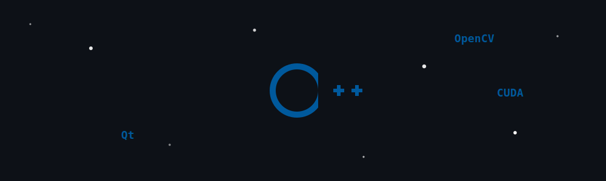

# 🚀 SNIPPETS Project

  

### Bienvenido a la biblioteca central de estructuras y soluciones de código.

  

Esta biblioteca de `SNIPPETS` se fundamenta en una arquitectura modular y escalable, diseñada para que cada componente actúe como una pieza independiente dentro de un sistema coherente. El propósito es ofrecer una estructura lógica donde la organización del conocimiento sea tan importante como el código mismo. Este es un proyecto en constante evolución y, como toda obra humana, está sujeto a mejoras. Si encuentras algún error o tienes una sugerencia, te invito a abrir una Issue o enviarme un mensaje; tu feedback es una herramienta vital para pulir este mapa de soluciones y aprender juntos en el proceso.

**Declaración de honestidad del autor**: El contenido de este repositorio y la profundidad teórica de los temas son fruto de un proceso de co-creación con `AI on Google Search, powered by the Gemini family of models`. Como aprendiz en muchas de estas áreas, este soporte me ha permitido organizar y presentar soluciones que superan mi dominio actual, permitiéndome aprender en el proceso. Espero que este material sea útil y que mi curiosidad por seguir ampliándolo se mantenga intacta.

## 📁 Estructura del Proyecto

### 🔹 10-cpp-core
- **C++ Moderno:** Implementación de algoritmos, gestión de memoria (smart pointers), programación orientada a objetos (POO) y estándares recientes del lenguaje.

### 🔹 20-qt-framework
- **Qt Framework:** Desarrollo de interfaces gráficas (GUI) y lógica de aplicaciones multiplataforma.
- Enfoque en: Core de Qt, sistema de Señales y Slots, gestión de Widgets y eventos.

### 🔹 30-opencv-vision
- **OpenCV (Computer Vision):** Biblioteca de código abierto para visión artificial y procesamiento de imágenes en tiempo real.
- Aplicaciones: Filtrado, detección de objetos, transformaciones espaciales y análisis matricial.

### 🔹 40-qt-opencv
- **Integración Visual:** Implementación de flujos de video y procesamiento de imágenes dentro de interfaces gráficas interactivas.

### 🔹 50-cuda-parallel
- **GPGPU (General-Purpose computing on GPUs):** Uso de la unidad de procesamiento gráfico para cálculos computacionales masivos.
- **CUDA:** Computación paralela de alto rendimiento utilizando núcleos NVIDIA para optimizar algoritmos intensivos.

> "La ilusión es el motor de la creación; el orden es el motor de la maestría."
